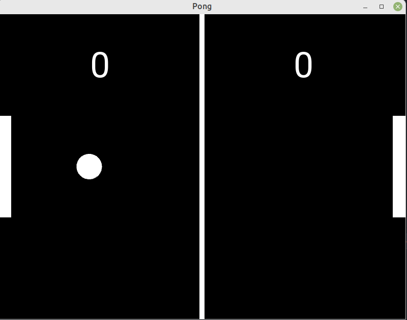

# Pong_Game_with_Kivy  
Write pong game application using Kivy.  
Kivy is an Open Source Python App development Framework.  

## Requirement:  
Install Kivy using,  
  - conda: ```conda install kivy -c conda-forge```  
  - pip: ```python -m pip install "kivy[base]" kivy_examples```  
[source: ](https://kivy.org/doc/stable/gettingstarted/installation.html#install-pip)  

## Screenshot:  

